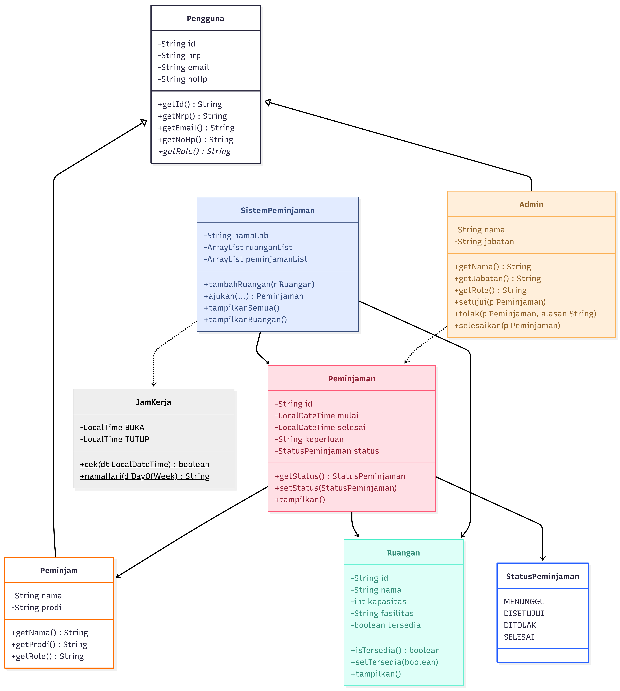

# OOP - Sistem Peminjaman Laboratorium KCKS
## Mata Kuliah
Struktur Data dan Pemrograman Berorientasi Objek
- Nama : Ferlin Erdina Sari
- NRP : 5027251002
- Kelas : B
---
## Deskripsi Kasus
Program ini merupakan sistem peminjaman ruangan laboratorium KCKS yang digunakan untuk mengatur peminjaman ruangan oleh mahasiswa.
Dalam sistem ini terdapat beberapa peran:
- **Peminjam (Mahasiswa** yang mengajukan peminjaman
- **Admin** yang memproses peminjaman
- **Sistem** yang mengelola data ruangan dan peminjaman

Sistem juga memiliki aturan yaitu:
- Peminjaman hanya boleh dilakukan pada **hari kerja (Senin–Jumat)**
- Jam operasional: **08.00 – 16.00**
- Ruangan tidak boleh dipinjam jika sedang digunakan
## Class Diagram
Class diagram ini menggambarkan sistem peminjaman ruangan laboratorium KCKS yang menggunakan konsep Object-Oriented Programming (OOP). Setiap class memiliki peran dan fungsi masing-masing dalam mengelola proses peminjaman.
#### Struktur utama sistem:
- `Pengguna` sebagai abstract class
- `Peminjam` dan `Admin` sebagai turunan dari `Pengguna`
- `Ruangan` sebagai objek yang dapat dipinjam
- `Peminjaman` sebagai representasi transaksi peminjaman
- `SistemPeminjaman` sebagai pengelola proses
- `StatusPeminjaman` sebagai `enum` untuk status peminjaman
- `JamKerja` untuk validasi waktu
#### Relasi antar class:
- `Peminjam` dan `Admin` mewarisi `Pengguna`
- `Peminjaman` berhubungan dengan:
  - `Peminjam`
  - `Ruangan`
  - `StatusPeminjaman`
- `SistemPeminjaman` mengelola:
  - `daftar Ruangan`
  - `daftar Peminjaman`
- `JamKerja` digunakan oleh sistem untuk validasi waktu
## Output Diagram


---
## Penjelasan Tiap Class
### 1. Class `Pengguna`
Class `Pengguna` adalah abstract class. Class ini tidak digunakan untuk membuat object secara langsung, tetapi dipakai sebagai parent class untuk class yang mewarisinya, yaitu `Peminjam` dan `Admin`.
Atribut dalam class ini:
- `id` digunakan sebagai identitas unik pengguna
- `nrp` menyimpan nomor induk mahasiswa
- `email` menyimpan alamat email
- `noHp` menyimpan nomor telepon

Class ini juga memiliki method `getRole()` yang dibuat abstract. Artinya, setiap class turunan wajib memiliki implementasi `getRole()` sendiri sesuai perannya masing-masing. Peminjam akan memiliki role sebagai mahasiswa, sedangkan admin akan memiliki role sebagai admin lab.
### Kode `Pengguna.java`
```java
public abstract class Pengguna {
    private String id;
    private String nrp;
    private String email;
    private String noHp;

    public Pengguna(String id, String nrp, String email, String noHp) {
        this.id = id;
        this.nrp = nrp;
        this.email = email;
        this.noHp = noHp;
    }

    public String getId() { return id; }
    public String getNrp() { return nrp; }
    public String getEmail() { return email; }
    public String getNoHp() { return noHp; }

    public void setId(String id) { this.id = id; }
    public void setNrp(String nrp) { this.nrp = nrp; }
    public void setEmail(String email) { this.email = email; }
    public void setNoHp(String noHp) { this.noHp = noHp; }

    public abstract String getRole();
}
```
### 2. Class `Peminjam`
Class `Peminjam` adalah turunan dari class `Pengguna` yang merepresentasikan mahasiswa sebagai user yang mengajukan peminjaman ruangan.
Class ini mewarisi seluruh atribut dari Pengguna, lalu menambahkan atribut yang lebih spesifik untuk mahasiswa, yaitu:
- `nama` digunakan untuk menyimpan nama lengkap peminjam
- `prodi` menunjukkan program studi dari mahasiswa

Pada class ini, method `getRole()` dioverride agar menghasilkan keterangan role yang sesuai, misalnya "Mahasiswa - Teknologi Informasi" atau "Mahasiswa - Sistem Informasi".
### Kode `Peminjam.java`
```java
public class Peminjam extends Pengguna {
    private String nama;
    private String prodi;

    public Peminjam(String id, String nrp, String email, String noHp,
                    String nama, String prodi) {
        super(id, nrp, email, noHp);
        this.nama = nama;
        this.prodi = prodi;
    }

    public String getNama() { return nama; }
    public String getProdi() { return prodi; }

    public void setNama(String nama) { this.nama = nama; }
    public void setProdi(String prodi) { this.prodi = prodi; }

    @Override
    public String getRole() {
        return "Mahasiswa - " + prodi;
    }
}
```
### 3. Class `Admin`
Class `Admin` adalah turunan dari `Pengguna`. admin bertugas memproses pengajuan ruangan.
Class ini memiliki atribut:
- `nama` digunakan menyimpan nama admin
- `jabatan` menunjukkan posisi admin di laboratorium, misalnya kepala lab

Method yang ada di dalam class `admin` adalah :
- `setujui(Peminjaman p)` digunakan untuk mengubah status peminjaman dari MENUNGGU menjadi DISETUJUI
- `tolak(Peminjaman p, String alasan)` digunakan untuk mengubah status menjadi DITOLAK
- `selesaikan(Peminjaman p)` digunakan untuk menandai peminjaman selesai
### Kode `Admin.java`
```java
public class Admin extends Pengguna {
    private String nama;
    private String jabatan;
    
    public Admin(String id, String nrp, String email, String noHp, String nama, String jabatan) {
        super(id, nrp, email, noHp);
        this.nama = nama;
        this.jabatan = jabatan;
    }

    public String getNama() { return nama; }
    public String getJabatan() { return jabatan; }

    public void setNama(String nama) { this.nama = nama; }
    public void setJabatan(String jabatan) { this.jabatan = jabatan; }

    @Override
    public String getRole() {
        return "Admin - " + jabatan;
    }

    public void setujui(Peminjaman p) {
        if (p.getStatus() == StatusPeminjaman.MENUNGGU) {
            p.setStatus(StatusPeminjaman.DISETUJUI);
            p.getRuangan().setTersedia(false);
            System.out.println("[ADMIN] " + p.getId() + " disetujui oleh " + nama);
        }
    }

    public void tolak(Peminjaman p, String alasan) {
        if (p.getStatus() == StatusPeminjaman.MENUNGGU) {
            p.setStatus(StatusPeminjaman.DITOLAK);
            System.out.println("[ADMIN] " + p.getId() + " ditolak. Alasan: " + alasan);
        }
    }

    public void selesaikan(Peminjaman p) {
        if (p.getStatus() == StatusPeminjaman.DISETUJUI) {
            p.setStatus(StatusPeminjaman.SELESAI);
            p.getRuangan().setTersedia(true);
            System.out.println("[ADMIN] " + p.getId() + " selesai. ");
        }
    }
}
```
### 4. Class `Ruangan`
Class `Ruangan` digunakan untuk menyimpan data ruangan laboratorium yang tersedia untuk dipinjam.
Atribut pada class ruangan yaitu:
- `id` untuk identitas ruangan
- `nama` untuk nama ruangan
- `kapasitas` untuk kapasitas maksimal ruangan
- `fasilitas` untuk informasi fasilitas ruangan
- `tersedia` untuk menunjukkan apakah ruangan bisa dipinjam atau tidak

Atribut tersedia bertipe boolean. Karena Jika nilainya `true`, ruangan dapat dipinjam. Jika `false`, ruangan sedang dipakai atau tidak tersedia.
### Kode `Ruangan.java`
```java
public class Ruangan {
    private String id;
    private String nama;
    private int kapasitas;
    private String fasilitas;
    private boolean tersedia;

    public Ruangan(String id, String nama, int kapasitas, String fasilitas ) {
        this.id = id;
        this.nama = nama;
        this.kapasitas = kapasitas;
        this.fasilitas = fasilitas;
        this.tersedia = true;
    }

    public String getId() { return id; }
    public String getNama() { return nama; }
    public int getKapasitas() { return kapasitas; }
    public String getFasilitas() { return fasilitas; }
    public boolean isTersedia() { return tersedia; }

    public void setId(String id) { this.id = id; }
    public void setNama(String nama) { this.nama = nama; }
    public void setKapasitas(int kapasitas) { this.kapasitas = kapasitas; }
    public void setFasilitas(String fasilitas) { this.fasilitas = fasilitas; }
    public void setTersedia(boolean tersedia) { this.tersedia = tersedia; }

    public void tampilkan() {
        System.out.println(" [" + id + "] " + nama
            + " | Kapasitas: " + kapasitas
            + " | Fasilitas: " + fasilitas
            + " | Status: " + (tersedia ? "Tersedia" : "Sedang Dalam Peminjaman"));
    }
}
```
### 5. Class `Peminjaman`
Class `Peminjaman` menjadi inti dari sistem karena semua proses pengajuan, persetujuan, penolakan, dan penyelesaian ada pada object dari class ini.
Atribut dari clas `peminjaman` adalah:
- `id` sebagai identitas transaksi
- `peminjam` sebagai mahasiswa yang mengajukan
- `ruangan` sebagai object ruangan yang dipinjam
- `mulai` sebagai waktu mulai peminjaman
- `selesai` sebagai waktu selesai peminjaman
- `keperluan` sebagai alasan peminjaman ruangan
- `status` sebagai kondisi transaksi saat ini

Saat object Peminjaman dibuat, status otomatis diisi `StatusPeminjaman.MENUNGGU`. hal ini menunjukkan bahwa setiap pengajuan baru tidak langsung disetujui, melainkan harus menunggu proses admin.
### Kode `Peminjaman.java`
```java
import java.time.LocalDateTime;
import java.time.format.DateTimeFormatter;

public class Peminjaman {
    private String id;
    private Peminjam peminjam;
    private Ruangan ruangan;
    private LocalDateTime mulai;
    private LocalDateTime selesai;
    private String keperluan;
    private StatusPeminjaman status;

    static final DateTimeFormatter FMT = 
        DateTimeFormatter.ofPattern("dd-MM-yyyy HH:mm");

    public Peminjaman(String id, Peminjam peminjam, Ruangan ruangan, LocalDateTime mulai, LocalDateTime selesai, String keperluan) {
        this.id = id;
        this.peminjam = peminjam;
        this.ruangan = ruangan;
        this.mulai = mulai;
        this.selesai = selesai;
        this.keperluan = keperluan;
        this.status = StatusPeminjaman.MENUNGGU;
    }

    public String getId() { return id; }
    public Peminjam getPeminjam() { return peminjam; }
    public Ruangan getRuangan() { return ruangan; }
    public LocalDateTime getMulai() { return mulai; }
    public LocalDateTime getSelesai() { return selesai; }
    public String getKeperluan() { return keperluan; }
    public StatusPeminjaman getStatus() { return status; }

    public void setId(String id) { this.id = id; }
    public void setPeminjam(Peminjam peminjam) { this.peminjam = peminjam; }
    public void setRuangan(Ruangan ruangan) { this.ruangan = ruangan; }
    public void setMulai(LocalDateTime mulai) { this.mulai = mulai; }
    public void setSelesai (LocalDateTime selesai) { this.selesai = selesai; }
    public void setKeperluan(String keperluan) { this.keperluan = keperluan; }
    public void setStatus(StatusPeminjaman status) { this.status = status; }

    public void tampilkan() {
        System.out.println(" ID            : " + id);
        System.out.println(" Peminjam      : " + peminjam.getNama()
                                             + " (" + peminjam.getNrp() + ")");
        System.out.println(" Ruangan       :  " + ruangan.getNama());
        System.out.println(" Mulai         : " + mulai.format(FMT));
        System.out.println(" Selesai       : " + selesai.format(FMT));
        System.out.println(" Keperluan     : " + keperluan);
        System.out.println(" Status        : " + status);
    }
}
```
### 6. Enum `StatusPeminjaman`
`StatusPeminjaman` dibuat dalam bentuk enum karena status peminjaman hanya boleh memiliki sejumlah nilai yang sudah pasti dan terbatas.
Nilai yang tersedia:
- `MENUNGGU`
- `DISETUJUI`
- `DITOLAK`
- `SELESAI`
### Kode `StatusPeminjaman.java`
```java
public enum StatusPeminjaman {
    MENUNGGU, DISETUJUI, DITOLAK, SELESAI
}
```
### 7. Class `JamKerja`
Class `JamKerja` adalah class yang bertugas memvalidasi apakah waktu peminjaman berada dalam jam operasional laboratorium.
Atribut tetap pada class ini:
- `BUKA = 08:00`
- `TUTUP = 16:00`

Method utama:
- `cek(LocalDateTime dt)` untuk mengecek apakah tanggal dan waktu valid
- `namaHari(DayOfWeek d)` untuk mengubah nama hari

Method di class ini dibuat `static`, artinya bisa dipanggil langsung tanpa membuat object `JamKerja`.
### Kode `JamKerja.java`
```java
import java.time.DayOfWeek;
import java.time.LocalDateTime;
import java.time.LocalTime;

public class JamKerja {
    private static final LocalTime BUKA = LocalTime.of(8, 0);
    private static final LocalTime TUTUP = LocalTime.of(16, 0);

    public static boolean cek(LocalDateTime dt) {
        DayOfWeek hari = dt.getDayOfWeek();
        LocalTime jam = dt.toLocalTime();
        boolean hariOke = hari != DayOfWeek.SATURDAY    
                        && hari != DayOfWeek.SUNDAY;
        boolean jamOke = !jam.isBefore(BUKA) && !jam.isAfter(TUTUP);
        return hariOke && jamOke;
    }

    public static String namaHari(DayOfWeek d) {
        switch (d) {
            case MONDAY: return "Senin";
            case TUESDAY: return "Selasa";
            case WEDNESDAY: return "Rabu";
            case THURSDAY: return "Kamis";
            case FRIDAY: return "Jumat";
            case SATURDAY: return "Sabtu";
            default: return "Minggu";
        }
    }
}
```
### 8. Class `SistemPeminjaman`
Class `SistemPeminjaman` bertanggung jawab mengelola seluruh data dan proses utama, seperti:
- menyimpan daftar ruangan
- menyimpan daftar transaksi peminjaman
- mencari ruangan 
- menerima pengajuan baru 
- menampilkan seluruh data
  
Atribut dalam class ini adalah:
- `namaLab`
- `ruanganList`
- `peminjamanList`
- `counter`

`ruanganList` dan `peminjamanList` menggunakan `ArrayList` karena jumlah ruangan dan transaksi bisa lebih dari satu.
### Kode `SistemPeminjaman.java`
```java
import java.time.LocalDateTime;
import java.util.ArrayList;

public class SistemPeminjaman {
    private String namaLab;
    private ArrayList<Ruangan> ruanganList = new ArrayList<>();
    private ArrayList<Peminjaman> peminjamanList = new ArrayList<>();
    private int counter = 1;

    public SistemPeminjaman(String namaLab) {
        this.namaLab = namaLab;
    }
    
    public String getNamaLab() { return namaLab; }
    public ArrayList<Ruangan> getRuanganList() { return ruanganList; }
    public ArrayList<Peminjaman> getPeminjamanList() { return peminjamanList; }
    public void setNamaLab(String namaLab) { this.namaLab = namaLab; }

    public void tambahRuangan (Ruangan r) {
        ruanganList.add(r);
    }

    public Ruangan cariRuangan(String id) {
        for (Ruangan r : ruanganList) {
            if (r.getId().equals(id)) return r;
        }
        return null;
    }

    public Peminjaman ajukan(Peminjam peminjam, String idRuangan, LocalDateTime mulai, LocalDateTime selesai, String keperluan) {
        System.out.println("\n[SISTEM] Pengajuan dari " + peminjam.getNama() + "...");

        if (!JamKerja.cek(mulai)) {
            System.out.println("[GAGAL] "
                + JamKerja.namaHari(mulai.getDayOfWeek())
                + " " + mulai.toLocalTime()
                + " di luar jam kerja (Senin - Jumat 08:00 - 16:00).");
            return null;
        }

        if (!JamKerja.cek(selesai)) {
            System.out.println("[GAGAL] Waktu selesai di luar jam kerja.");
            return null;
        }

        Ruangan r = cariRuangan(idRuangan);
        if (r == null) {
            System.out.println("[GAGAL] Ruangan tidak ditemukan.");
            return null;
        }

        if (!r.isTersedia()) {
            System.out.println("[GAGAL] Ruangan sedang dipinjam.");
            return null;
        }

        String id = String.format("PJM-%03d", counter++);
        Peminjaman p = new Peminjaman(id, peminjam, r, mulai, selesai, keperluan);
        peminjamanList.add(p);
        System.out.println("[OK] Berhasil diajukan dengan ID : " + id);
        return p;
    }

    public void tampilkanSemua() {
        System.out.println("\n=== RIWAYAT PEMINJAMAN LAB " + namaLab + " ===");
        for (Peminjaman p : peminjamanList) {
            p.tampilkan();
            System.out.println(" ===");
        }
    }

    public void tampilkanRuangan() {
        System.out.println("\n=== DAFTAR RUANGAN LAB " + namaLab + " ===");
        for (Ruangan r : ruanganList) {
            r.tampilkan();
        }
    }
}
```
### 9. Class `Main`
Class `Main` digunakan untuk menjalankan seluruh proses dan menampilkan hasil akhie
pada class `main()` dilakukan beberapa langkah:
- membuat object `SistemPeminjaman`
- menambahkan beberapa data ruangan
- membuat beberapa object `Peminjam`
- membuat object `Admin`
- melakukan simulasi pengajuan,
- memproses pengajuan dengan admin
- menampilkan hasil akhir
### Kode `Main.java`
```java
import java.time.LocalDateTime;

public class Main {
    public static void main(String[] args) {

        SistemPeminjaman sistem = new SistemPeminjaman("KCKS");

        sistem.tambahRuangan(new Ruangan("R-01", "Lab KCKS A", 30, "PC, Proyektor, AC"));
        sistem.tambahRuangan(new Ruangan("R-02", "Lab KCKS B", 25, "PC, Layar, AC"));
        sistem.tambahRuangan(new Ruangan("R-03", "Ruangan Server KCKS", 10, "Server rack, AC, Proyektor"));
        sistem.tampilkanRuangan();

        Peminjam Alin = new Peminjam("U-01", "5027251002", "5027251002@student.its.ac.id", "0896111222333", "Ferlin Erdina", "Teknologi Informasi" );
        Peminjam Dian = new Peminjam("U-02", "5025251031", "5025251031@student.its.ac.id", "0896111333444", "Dian Piramidiana", "Sistem Informasi" );
        Peminjam Donna = new Peminjam("U-01", "5027251011", "5027251011@student.its.ac.id", "0896111222444", "Donnavie Putri", "Teknologi Informasi" );
        Peminjam Aura = new Peminjam("U-03", "5024251012", "5024251012@student.its.ac.id", "0896111555777", "Aura Sabila", "Teknik Komputer" );
        Peminjam Arra = new Peminjam("U-02", "5025251044", "5025251044@student.its.ac.id", "0896111333888", "Arrumanta Ekna", "Sistem Informasi" );
        Peminjam Catur = new Peminjam("U-03", "5024251066", "5024251066@student.its.ac.id", "0896111555999", "Catur Setyo", "Teknik Komputer" );
        Admin admin = new Admin ("A-01", "ADM001", "handramanudinata@lab.ac.id", "088641234", "Dr. Hendra Manudinata", "Kepala Lab");

        System.out.println("\n=== SKENARIO PEMINJAMAN ===");

        Peminjaman pA = sistem.ajukan(Alin, "R-01",
            LocalDateTime.of(2026,1, 6, 9, 0),
            LocalDateTime.of(2026, 1, 6, 11, 0), "Praktikum Struktur Data" );
        Peminjaman pB = sistem.ajukan(Dian, "R-02", 
            LocalDateTime.of(2026, 1, 10, 14, 0),
            LocalDateTime.of(2026, 1, 10, 16, 0), "Praktikum SISOP");

        sistem.ajukan(Donna, "R-01",
            LocalDateTime.of(2026, 1, 11, 10, 0),
            LocalDateTime.of(2026, 1, 11, 12, 0), "Praktikum SBD");
        sistem.ajukan(Aura, "R-03",
            LocalDateTime.of(2026, 1, 6, 7, 0),
            LocalDateTime.of(2026, 1, 6, 9, 0), "Belajar Jaringan Komputer");
        sistem.ajukan(Arra, "R-02",
            LocalDateTime.of(2025, 1, 8, 17, 0),
            LocalDateTime.of(2025, 1, 8, 18, 0), "Belajar Kalkulus");     
        sistem.ajukan(Catur, "R-03",
            LocalDateTime.of(2025, 1, 12, 10, 0),
            LocalDateTime.of(2025, 1, 12, 12, 0), "Persiapan Lomba");  

        Peminjaman pG = sistem.ajukan(Alin, "R-03",
            LocalDateTime.of(2026, 1, 9, 10, 0),
            LocalDateTime.of(2026, 1, 9, 12, 0), "Maintenance Server");

        System.out.println("\n=== Proses ADMIN ===");
        if (pA != null) admin.setujui(pA);
        if (pB != null) admin.tolak(pB, "Ruangan dipakai kegiatan dosen");
        if (pG != null) admin.setujui(pG);
        if (pA != null) admin.selesaikan(pA);

        sistem.tampilkanSemua();
        sistem.tampilkanRuangan();
    }
}
```
---
### Object Pada Program
Object dibuat di dalam class `Main`. Contohnya:
```java
Peminjam Alin = new Peminjam(...);
Admin admin = new Admin(...);
SistemPeminjaman sistem = new SistemPeminjaman("KCKS");
```
- `Alin`, `Dian`, `Donna`, `Aura`, `Arra`, dan `Catur` adalah object dari class `Peminjam`
- `admin` adalah object dari class `Admin`
- `sistem` adalah object dari class `SistemPeminjaman`
### Constructor
Constructor digunakan untuk memberikan nilai awal pada object saat object dibuat.
Contoh constructor pada class `Pengguna`:
```java
public Pengguna(String id, String nrp, String email, String noHp) {
    this.id = id;
    this.nrp = nrp;
    this.email = email;
    this.noHp = noHp;
}
```
Constructor ini dipanggil oleh class turunan menggunakan `super(...)`.

Contoh pada `Peminjam`:
```java
public Peminjam(String id, String nrp, String email, String noHp,
                String nama, String prodi) {
    super(id, nrp, email, noHp);
    this.nama = nama;
    this.prodi = prodi;
}
```
Artinya, data umum diisi oleh parent class, sedangkan data khusus diisi oleh child class.

---
## Output
**1. Daftar Ruangan Lab KCKS**


**2. Proses Peminjaman**


**3. Proses Admin**


**4. Riwayat Peminjaman Lab KCKS**


